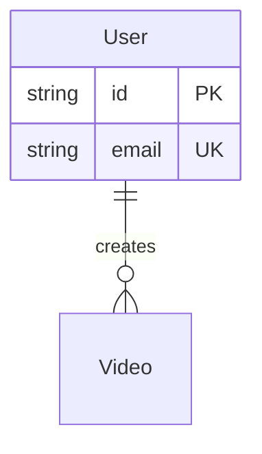
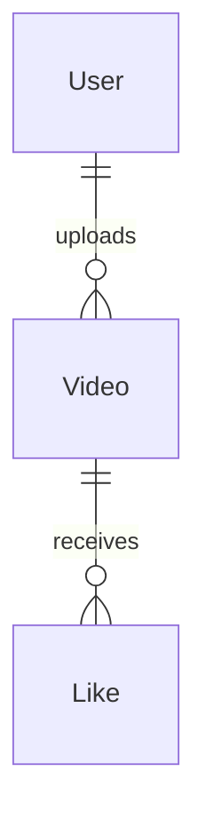
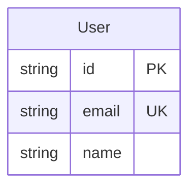
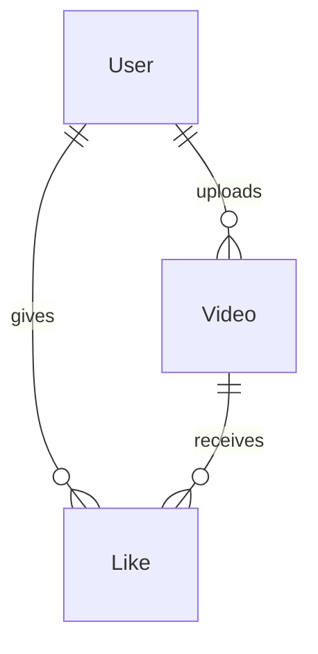
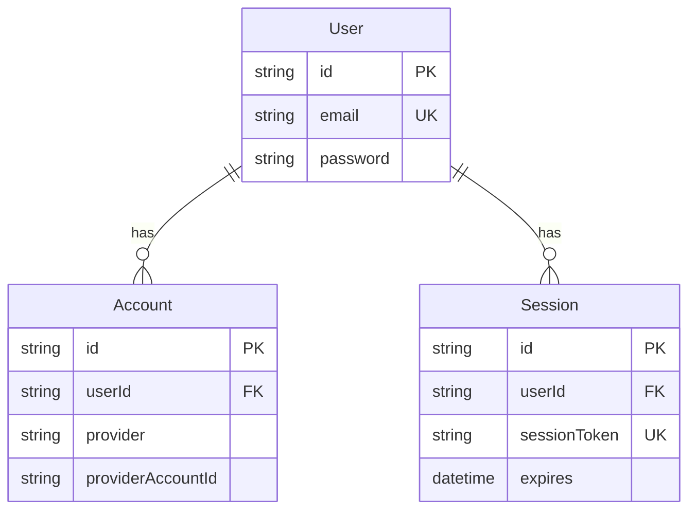
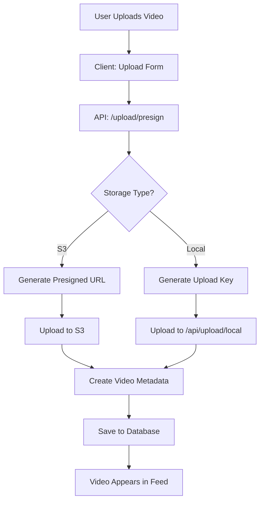
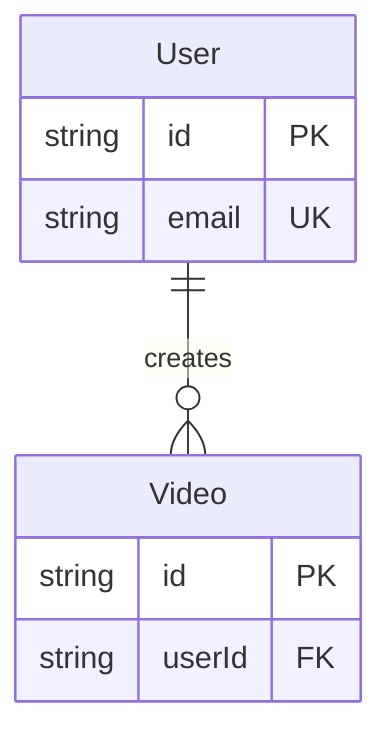

# Schema Diagrams Design Guide

This guide explains how to design and create schema diagrams for your database.

## Table of Contents
1. [Quick Start](#quick-start)
2. [Diagram Types](#diagram-types)
3. [Tools Comparison](#tools-comparison)
4. [Step-by-Step Tutorials](#step-by-step-tutorials)
5. [Best Practices](#best-practices)
6. [Examples](#examples)

---

## Quick Start

### Option 1: Generate from Prisma Schema (Easiest)

```bash
# Install prisma-erd-generator
npm install -D prisma-erd-generator

# Add to prisma/schema.prisma:
generator erd {
  provider = "prisma-erd-generator"
  output = "./docs/ERD.md"
}

# Generate the diagram
npx prisma generate
```

### Option 2: Use dbdiagram.io (Visual Editor)

1. Go to https://dbdiagram.io
2. Copy your Prisma schema
3. Use their Prisma import feature
4. Export as PNG or share link

### Option 3: Create Mermaid Diagram (For Documentation)

Use the Mermaid ERD syntax (already included in `DOCUMENTATION.md`):



---

## Diagram Types

### 1. Entity Relationship Diagram (ERD)
Shows entities (tables) and their relationships.

**Use when:**
- Documenting database structure
- Explaining relationships to team
- Planning new features

**Example:**


### 2. Table Structure Diagram
Shows detailed column information for each table.

**Use when:**
- Detailed documentation
- Database migration planning
- API design

### 3. Data Flow Diagram
Shows how data moves through the system.

**Use when:**
- Explaining business logic
- Onboarding new developers
- System architecture documentation

---

## Tools Comparison

| Tool | Type | Cost | Best For | Ease of Use |
|------|------|------|----------|-------------|
| **Mermaid** | Text-based | Free | Documentation, GitHub | ⭐⭐⭐⭐⭐ |
| **dbdiagram.io** | Web-based | Free/Paid | Quick visual ERDs | ⭐⭐⭐⭐⭐ |
| **Prisma Studio** | Desktop/Web | Free | Exploring data | ⭐⭐⭐⭐ |
| **Draw.io** | Web/Desktop | Free | Custom diagrams | ⭐⭐⭐ |
| **MySQL Workbench** | Desktop | Free | PostgreSQL/MySQL | ⭐⭐⭐ |
| **Lucidchart** | Web-based | Paid | Professional diagrams | ⭐⭐⭐⭐ |

---

## Step-by-Step Tutorials

### Tutorial 1: Creating Mermaid ERD

1. **Open Mermaid Live Editor**: https://mermaid.live

2. **Define Entities**:


3. **Add Relationships**:

   - `||--o{` means "one to many"
   - `||--||` means "one to one"
   - `}o--o{` means "many to many"

4. **Add All Tables**:


5. **Copy to Markdown**: Paste into your `.md` file

### Tutorial 2: Using dbdiagram.io

1. **Visit**: https://dbdiagram.io
2. **Create Account** (optional, for saving)
3. **Import Prisma Schema**:
   - Click "Import"
   - Select "Prisma"
   - Paste your `schema.prisma` content
4. **Customize**:
   - Adjust colors
   - Rearrange tables
   - Add notes
5. **Export**:
   - PNG: For presentations
   - PDF: For documentation
   - Share link: For collaboration

### Tutorial 3: Prisma ERD Generator

1. **Install**:
```bash
npm install -D prisma-erd-generator
```

2. **Update `prisma/schema.prisma`**:
```prisma
generator erd {
  provider = "prisma-erd-generator"
  output = "./docs/ERD.md"
  title = "IntApp Database Schema"
}
```

3. **Generate**:
```bash
npx prisma generate
```

4. **View**: Open `./docs/ERD.md`

---

## Best Practices

### 1. Keep Diagrams Updated
- Update diagrams when schema changes
- Include in pull request reviews
- Version control your diagrams

### 2. Use Multiple Views
- **High-level**: Main entities only
- **Detailed**: All fields and relationships
- **Domain-specific**: Focused on one area (e.g., auth)

### 3. Show Important Information
- Primary keys (PK)
- Foreign keys (FK)
- Unique constraints (UK)
- Indexes
- Cascade delete rules

### 4. Organize Visually
- Group related tables
- Use consistent colors
- Align tables neatly
- Add legends/notes

### 5. Make It Accessible
- Use clear naming
- Add descriptions
- Include examples
- Link to detailed docs

---

## Examples

### Example 1: Simple ERD (High-Level)


### Example 2: Detailed ERD (Full Schema)

See `DOCUMENTATION.md` for the complete detailed ERD.

### Example 3: Domain-Specific (Authentication Only)



### Example 4: Data Flow Diagram



---

## Quick Reference

### Mermaid ERD Syntax

**Cardinality:**
- `||--||` : One to One
- `||--o{` : One to Many
- `}o--o{` : Many to Many
- `}o--||` : Many to One

**Field Types:**
- `PK` : Primary Key
- `FK` : Foreign Key
- `UK` : Unique Key

**Example:**


### Prisma Schema to Mermaid Conversion

| Prisma | Mermaid |
|--------|---------|
| `@id` | `PK` |
| `@unique` | `UK` |
| `@relation` | `FK` |
| `User[]` | `||--o{` (one-to-many) |
| `User?` | `||--o|` (one-to-one optional) |

---

## Resources

- **Mermaid Documentation**: https://mermaid.js.org/
- **dbdiagram.io**: https://dbdiagram.io
- **Prisma ERD Generator**: https://github.com/keonik/prisma-erd-generator
- **Draw.io**: https://app.diagrams.net
- **QuickDBD**: https://www.quickdatabasediagrams.com

---

## Troubleshooting

### Mermaid Not Rendering in GitHub
- Ensure you're using the correct syntax
- Check for syntax errors in the Mermaid Live Editor
- Some GitHub features require specific Mermaid versions

### Prisma ERD Generator Not Working
- Ensure generator is added to `schema.prisma`
- Run `npx prisma generate` after adding generator
- Check output path exists

### dbdiagram.io Import Fails
- Verify Prisma schema syntax is correct
- Try importing smaller sections
- Use manual creation if import fails

---

**Last Updated**: 2024-12-XX

